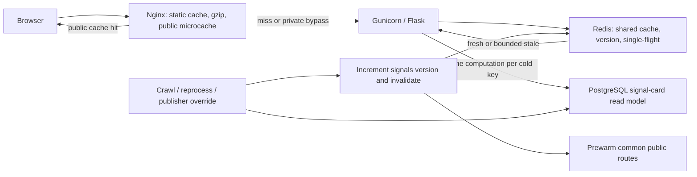

# Homepage and Filter Performance Scaling Design

**Date:** 2026-08-01

**Status:** Approved in conversation; awaiting written-spec review

**Scope:** `radarbds.vn` public homepage, signal feed, filters, supporting summary/count APIs, PostgreSQL read path, Redis, Gunicorn/systemd, and Nginx

**Capacity target:** bursts of up to 5,000 concurrent in-flight requests on the public homepage and common signal-filter paths; this is not a claim of 5,000 sustained requests per second

## 1. Goal

Make the public Radar BDS homepage feel fast on first load and after filtering while keeping the system stable during large traffic bursts.

The design must:

- keep the first useful signal cards fast;
- prevent identical requests from repeatedly executing expensive PostgreSQL work;
- preserve the current guest/Free/VIP/admin data-redaction contract;
- keep normal public data freshness within 60 seconds and invalidate immediately after successful data-changing workflows;
- degrade predictably when PostgreSQL or Redis is slow or unavailable;
- remain reversible by layer;
- document runtime behavior and verification clearly enough for later AI agents to operate safely.

## 2. Current-State Evidence

Measurements below were taken on 2026-08-01. They are evidence for this design, not permanent production facts.

### 2.1 Public production

| Surface | Observed result |
|---|---:|
| Homepage HTML TTFB | about 0.5-0.7 s |
| First Contentful Paint | about 0.94 s |
| DOMContentLoaded | about 1.34 s |
| Window load | about 1.65-2.87 s |
| Cold/default `/api/signals` | about 28-33 s |
| Cold/default `/api/dashboard` | about 33 s |
| `/api/counts` | about 1.7 s |
| Warm `/api/signals` on a reused connection | about 23-32 ms |

The page shell arrives much earlier than the useful listing feed. The signal loader remains visible for tens of seconds, and a filter interaction can repeat the same long wait.

The browser also observed JavaScript transfer sizes close to decoded sizes, so response compression must be verified and enabled where supported.

### 2.2 Local PostgreSQL

The local database contained roughly 21,796 listings, 16,862 valuation rows, 17,640 shadow valuation rows, and 94,483 listing images. The relevant planner statistics were initially missing. The first signal request took about 61.9 seconds.

After `ANALYZE` on the hot tables, representative results improved to:

| Query | Cold | Warm |
|---|---:|---:|
| Default Free signal feed | about 571 ms | about 4.6 ms |
| MOS/drop filter | about 249 ms | - |
| Facebook filter | about 199 ms | - |
| Ward filter | about 193 ms | - |
| Counts | about 137 ms | - |
| Dashboard summary | about 350 ms | about 7.7 ms |

This demonstrates that planner statistics are a major operational dependency. It does not prove that stale statistics are the only production cause.

### 2.3 Current bottlenecks and burst risks

- Gunicorn currently exposes only 2 workers x 4 threads, so the application can actively process about eight requests at once.
- Database connections are thread-local persistent psycopg connections, not a bounded shared pool.
- `_DASHBOARD_CACHE` and `_SIGNAL_CACHE` are per-process dictionaries. They do not share entries or locks between workers.
- Nginx serves static/image assets with immutable caching, but the public API has no shared microcache or cache lock.
- Flask applies `Cache-Control: no-store` to `/api/*`, preventing safe public edge reuse.
- One settled filter currently initiates signal, count, and dashboard requests. The dashboard request is not needed to display the filtered cards.
- The signal SQL computes latest valuation CTEs, publisher-visibility checks, publisher rank, and lateral image lookups in the request path.
- The current publisher visibility/rank expressions are correlated per listing, increasing the cost of the default Facebook-plus-Guland feed.

## 3. Constraints and Non-Goals

### 3.1 Hard product and security constraints

- `/api/dashboard` remains a lightweight summary. It must not become a full signal payload.
- `/api/signals` remains the paginated, compact, thumbnail-first card feed.
- User-facing signals must use the latest valuation plus `services.signal_quality.actionable_signal_sql()`.
- `low_segment_confidence` alone remains a warning, not a hard suppression.
- Guest, Free, and VIP responses must not expose original listing URLs or phone numbers. Only admin may receive them.
- Guland publisher visibility rules remain tier-aware. The performance work must not weaken publisher filtering or alter valuation logic.
- No external LLM verification is added to crawl, reprocess, or the hot request path.
- Cache optimization must preserve current URLs, API response shapes, SEO behavior, and frontend funnel behavior unless an explicitly versioned change is approved.

### 3.2 Capacity interpretation

The target is a burst of 5,000 concurrent in-flight public requests concentrated on the homepage and common filter keys. The design intentionally relies on shared caching, request collapse, and backpressure. It does not attempt to open 5,000 concurrent PostgreSQL queries or 5,000 Gunicorn worker slots.

Rare, adversarial, or unbounded filter combinations are not guaranteed the same cache hit rate as the default and common filters. They are protected with canonicalization, parameter bounds, rate limits, and bounded fallback concurrency.

### 3.3 Out of scope for the first release

- A full SPA or framework rewrite.
- Changing deterministic extraction, deduplication, or valuation formulas.
- Replacing PostgreSQL.
- A CDN dependency. Cloudflare or another CDN can be added later for geographic edge caching and DDoS absorption, but it is not required for the first release.
- An uncontrolled 5,000-concurrency test against production. That requires a controlled window, monitoring, abort thresholds, and explicit execution approval.

## 4. Chosen Architecture

Use a layered design: a PostgreSQL signal-card read model, shared Redis response caching with single-flight locks, Nginx public microcaching and stale serving, and fewer browser requests.



The layers have distinct responsibilities:

| Layer | Responsibility |
|---|---|
| Browser | Fetch signal cards first, cancel obsolete filters, avoid redundant metadata calls |
| Nginx | Serve static assets and identical anonymous GET responses without occupying Gunicorn |
| Redis | Share cache entries and locks across processes; version data; retain bounded stale responses |
| Flask/Gunicorn | Validate filters, enforce tier/redaction, shape compact responses, apply backpressure |
| PostgreSQL | Serve indexed, set-based reads from a precomputed signal-card read model |

### 4.1 Alternatives considered

- **SQL and frontend hotfix only:** useful as the first rollout step, but it still sends every burst request through Gunicorn and PostgreSQL. It cannot satisfy the 5,000-concurrency objective by itself.
- **Cache the current expensive query without a read model:** improves common warm keys, but a cold key, Redis restart, or high-cardinality filter burst can still recreate the 20-30 second query and stampede the database.
- **CDN-first:** valuable later for global edge and attack absorption, but it introduces another control plane before the origin correctness, cache boundaries, and invalidation semantics are proven.

The selected layered approach addresses both normal cold-query cost and duplicate burst work while allowing each layer to be disabled independently.

## 5. PostgreSQL Read Model and Query Shape

### 5.1 Signal-card read model

Add an additive PostgreSQL table named `signal_card_read_model` with one current row per listing eligible for feed evaluation. Add a durable one-row-per-dataset table named `public_dataset_versions`; its `signals` row is the authoritative monotonically increasing signal-feed version, and its `market` row covers independently updated market/trend aggregates. Redis mirrors those counters for the hot path and reloads them from PostgreSQL after a cold start.

It stores or joins in a set-based refresh:

- listing identity and public card fields;
- filter/sort fields such as source, location, property type, price, area, MOS, dates, and signal score;
- the latest valuation identity and values used by the current signal-quality gate;
- publisher visibility class and sort rank;
- primary thumbnail reference and image count;
- freshness/version metadata needed for reconciliation and invalidation.

The read model does not bypass application serialization. Raw/private fields remain protected by the existing tier-aware response shaping, and anonymous cached responses are generated only after redaction.

### 5.2 Refresh semantics

- Refresh affected listing IDs after the data-changing transaction commits.
- Use set-based `INSERT ... ON CONFLICT ... DO UPDATE` or an equivalent atomic swap; never expose a partially rebuilt public dataset.
- Recompute affected rows after listing normalization, valuation changes, image changes, publisher classification/override changes, and deletion/suppression changes.
- Provide an idempotent full-reconcile command for repair and deployment.
- Increment `public_dataset_versions.signals` in the same PostgreSQL transaction that publishes a successful read-model refresh. Redis is updated/invalidation is issued only after that transaction commits.
- If refresh fails, keep the previous complete version active and emit an operational error. Do not invalidate a known-good cache to point at incomplete data.

### 5.3 Hot query rules

- Join publisher activity/rank once in a set-based relation; remove correlated visibility and rank subqueries from the per-listing hot path.
- Apply visibility and scalar filters before image enrichment.
- Select the requested candidate page before any remaining expensive decoration.
- Use deterministic ordering with a stable listing-ID tie breaker so pages cannot duplicate or skip rows.
- Add indexes from measured `EXPLAIN (ANALYZE, BUFFERS)` evidence, not by guesswork.
- Run `ANALYZE` after large backfills or read-model rebuilds and ensure routine autovacuum/analyze thresholds suit the table churn.
- Enforce a short statement timeout on public read-model queries. A slow miss must not occupy a worker for the current 180-second Gunicorn timeout.

### 5.4 Equivalence requirement

Before cutover, shadow-run the read-model query against the current query on the same snapshot and compare:

- listing IDs and order for default and representative filters;
- total/page metadata;
- publisher visibility by tier;
- signal-quality inclusion and warning badges;
- redacted versus admin-only fields;
- primary image and image-count semantics.

Any unexplained difference blocks cutover.

## 6. Redis Cache, Keys, and Request Collapse

### 6.1 Cache policy

- Cache safe GET results for the public homepage support APIs, including signals, counts, and dashboard summary.
- Fresh TTL is at most 60 seconds.
- The initial Nginx microcache TTL is 15 seconds; Redis fresh TTL is 60 seconds. Both remain configuration values with these values as safe rollout defaults.
- Retain a separate stale copy for a bounded failure window. Initial design value: an additional 180 seconds. After that window, fail closed with a controlled error rather than serve indefinitely old data.
- Dataset-version invalidation normally makes new crawl/reprocess data visible before TTL expiry.
- Private/admin responses are not stored in the anonymous cache namespace.

### 6.2 Canonical cache key

Every application cache key includes:

```text
cache-schema-version
dataset-version
endpoint
effective-access-tier
normalized-filter-query
page-and-page-size
response-format-version
```

`/api/signals` and `/api/counts` depend on the `signals` version. `/api/dashboard` depends on both `signals` and `market`, represented as a deterministic version tuple. A future public endpoint must declare its dataset dependencies before it is made cacheable.

Normalization uses the same validated parser as SQL generation:

- apply defaults explicitly;
- sort and deduplicate multi-value filters such as ward, source, and property type;
- normalize enum casing and numeric formatting;
- discard unsupported parameters;
- cap page size and filter-list length;
- preserve only parameters that can change the response.

Equivalent filters must resolve to the same Redis key. The frontend must also emit a stable query-parameter order so Nginx sees the same URI for common requests.

### 6.3 Single-flight behavior

On a Redis miss:

1. Attempt a short-lived distributed lock with a unique ownership token.
2. The lock owner executes one bounded read-model query and stores fresh plus stale entries.
3. Other requests wait briefly with jitter, then re-read Redis.
4. If a prior stale entry exists, waiters may receive stale data immediately while the owner refreshes it.
5. Unlock only when the token still matches; never delete another request's lock.
6. If the lock owner fails, the lock expires automatically and the next bounded caller may retry.

The acceptance criterion is one database computation per cold cache key during a burst, not one computation per process.

### 6.4 Cardinality controls

- Set a maximum number of values per multi-select filter and a maximum page size.
- Apply per-IP and/or global limits to repeated cache-miss patterns without penalizing ordinary cached reads.
- Track Redis memory, eviction count, key count by endpoint, and hit ratio.
- Never embed secrets, raw session IDs, phone numbers, or original source URLs in cache keys or anonymous values.

## 7. Nginx, Gunicorn, and Connection Management

### 7.1 Nginx public microcache

- Cache only explicitly allowed anonymous `GET`/`HEAD` homepage and public API responses.
- Nginx stores only the guest/anonymous representation. It does not infer or cache Free/VIP/admin tiers; any authenticated request bypasses the edge cache and remains separated by tier in Redis.
- Bypass and never store authenticated, admin, non-GET, error, or `Set-Cookie` responses.
- Start fail-closed: enumerate the real Flask session/auth cookies during implementation and prove bypass tests before enabling cache.
- Include the exact request URI in the edge key. The frontend's canonical parameter ordering supplies common-key reuse.
- Enable cache locking so one upstream request fills a cold edge key.
- Permit bounded `stale-while-revalidate` and `stale-if-error` behavior consistent with the Redis stale window.
- Add internal diagnostic cache-status headers for verification, without exposing sensitive context.
- Preserve immutable caching for fingerprinted static assets and thumbnails.
- Enable gzip for compressible HTML, JSON, CSS, and JavaScript. Enable Brotli only when the installed Nginx module is verified; do not make the release depend on it.
- Use `worker_processes auto`, then set `worker_connections`, the Nginx/systemd open-file limit, and the listen backlog with headroom for at least 5,000 simultaneous client sockets plus miss-path upstream sockets. Count both sides of proxied connections; do not assume one client consumes only one descriptor.
- Verify HTTP/2, TLS session reuse, upstream keepalive, request buffering, and idle keepalive timeouts so idle clients cannot consume the entire connection budget.

The Flask blanket `no-store` behavior must become route/tier aware. Private responses remain `private, no-store`; only proven anonymous response variants receive cacheable headers.

### 7.2 Gunicorn

Do not size Gunicorn to the 5,000-client count. Nginx and Redis absorb duplicate concurrency. Gunicorn is sized from measured CPU, RAM, endpoint latency, and the PostgreSQL connection budget.

- Keep a bounded number of workers/threads.
- Reduce public endpoint timeout budgets from the current 180-second failure mode without changing long-running admin/job routes blindly.
- Set worker recycling/jitter and graceful timeouts appropriate to deployment.
- Monitor active workers, queueing, timeout count, and restarts.

Final worker/thread numbers are chosen only after reading production CPU/RAM, PostgreSQL `max_connections`, and measured load-test saturation.

### 7.3 Operating-system connection budget

Before the 5,000-concurrency stage, record and verify Nginx's effective `worker_rlimit_nofile`, systemd `LimitNOFILE`, per-process file-descriptor limit, `net.core.somaxconn`, listen backlog, and current socket usage. The effective limit is the smallest value in that chain.

Apply only measured, reversible settings in the repository's deployment configuration. Do not make broad `sysctl` changes by folklore, and do not load-test from the production VPS itself because the generator would compete for the same CPU, sockets, and network.

### 7.4 PostgreSQL connection budget

Replace unbounded thread-local growth on the public path with a bounded connection pool or an equivalent hard budget.

```text
all app instances x maximum app DB connections
  <= PostgreSQL max_connections
     - administration reserve
     - crawler/job reserve
     - safety reserve
```

Pool acquisition must have a short timeout. When the budget is exhausted, serve a valid stale response or a controlled `503 Retry-After`; do not wait for minutes and amplify the queue.

## 8. Frontend Request Flow

### 8.1 Initial homepage

1. Render the page shell and critical controls.
2. Fetch the first signal page as the highest-priority dynamic request.
3. Render compact cards immediately when it arrives.
4. Load counts or non-critical dashboard metadata afterward, from cache, or during idle time.

Do not make signal cards wait for counts, map decoration, or dashboard metadata.

### 8.2 Filter interaction

- Canonicalize the chosen filter state.
- Debounce rapid changes for roughly 150-250 ms.
- Abort the previous request when a newer settled filter is submitted.
- Issue one signal-feed request for the settled state.
- Do not refetch `/api/dashboard` on every filter.
- Refresh counts only when the UI genuinely needs them and only after the cards are no longer blocked.
- Tag requests with a monotonically increasing client sequence so an old response cannot overwrite a newer filter result.
- Reset pagination on material filter changes and deduplicate listing IDs during infinite scroll.

The existing response contract and visible filter behavior remain intact.

## 9. Invalidation and Prewarming

After a successful crawl/reprocess/publisher update that changes public feed data:

1. Commit database changes.
2. Refresh affected read-model rows, or complete the atomic full refresh.
3. Increment the durable `public_dataset_versions.signals` counter in the publishing transaction and mirror it to Redis after commit.
4. Invalidate or naturally orphan Redis entries from the old version.
5. Purge/expire affected Nginx microcache entries.
6. Prewarm the homepage, default signal page, default counts/dashboard, and a small configured set of common source/ward/property filters.
7. Record version, affected-row count, refresh duration, prewarm result, and failure state.

Prewarming is best effort after correctness is committed. A prewarm failure must not roll back valid crawl data, but it must alert and leave normal miss/single-flight behavior available.

Publisher override endpoints require the same refresh/version/invalidation path because they can change public visibility and ordering without a new crawl.

## 10. Failure Handling and Backpressure

| Failure | Required behavior |
|---|---|
| PostgreSQL query exceeds budget | Cancel by statement timeout; serve bounded stale if available; emit slow-query metric |
| Redis unavailable | Nginx may serve safe stale; otherwise admit only bounded DB fallback work through a local semaphore |
| Redis lock holder fails | Lock expires; waiter retries with jitter; no permanent deadlock |
| PostgreSQL pool exhausted | Do not block indefinitely; serve stale or `503 Retry-After` |
| PostgreSQL and caches unavailable | Controlled small JSON/HTML 503, not a request stampede |
| Read-model refresh fails | Keep previous complete version active; do not publish/invalidate to partial data |
| Nginx cache misconfiguration | Feature switch disables microcache while Redis/read-model path continues |
| Cardinality attack | Validate/cap filters, rate-limit misses, and protect DB fallback concurrency |

Circuit-breaker state must recover automatically after a short probe interval. Error responses must not be cached as successful public data.

## 11. Observability

Expose enough evidence to distinguish browser, edge, application cache, and database behavior:

- request count and p50/p95/p99 latency by endpoint and cache outcome;
- Nginx hit/miss/stale/bypass ratio;
- Redis hit ratio, lock contention, lock wait, errors, memory, and evictions;
- read-model query latency, rows scanned/returned, statement timeouts, and pool saturation;
- Gunicorn active workers, queueing, timeouts, and restarts;
- dataset version age, refresh duration, refresh failures, and prewarm status;
- frontend signal-fetch latency, aborted request count, and stale-response suppression;
- Core Web Vitals for the public homepage.

Use response/request IDs and safe timing fields to correlate layers. Do not log raw cookies, authorization values, phone numbers, or private listing URLs.

## 12. Acceptance Criteria

### 12.1 User experience

| Metric | Target |
|---|---:|
| Mobile LCP | <= 2.5 s |
| INP | <= 200 ms |
| CLS | <= 0.1 |
| Guest homepage cache-hit p95 TTFB | <= 200 ms |
| `/api/signals` cache-hit p95 | <= 250 ms |
| Cold read-model request p95 under normal load | <= 500 ms |

### 12.2 Capacity and stability

| Scenario | Target |
|---|---|
| 5,000 concurrent burst on default homepage/feed key | >= 99.5% successful responses, p95 <= 1 s, p99 <= 2 s |
| 1,000 concurrent mixed requests across <= 50 representative filter keys | p95 <= 1.5 s |
| Cold identical-key burst | One DB computation per key; no worker or DB-connection exhaustion |
| Redis failure drill | Bounded DB work, safe stale or controlled 503; no cascading timeout queue |
| Data publication | Normal freshness <= 60 s; explicit invalidation after successful refresh |

The capacity test must report cache state, error classes, server saturation, DB connections, and percentile latency. A raw average response time is insufficient.

### 12.3 Correctness and security

- Read-model/default-query parity is exact for the approved fixture/snapshot, or every difference is explicitly accepted.
- Guest/Free/VIP/admin redaction tests pass.
- Anonymous edge cache never serves an authenticated/admin response.
- Card payloads remain compact and do not include full descriptions or image arrays.
- Filter pagination is deterministic and produces no duplicate/missing cards during normal navigation.

## 13. Test-Driven Implementation and Verification

Implementation follows red-green-refactor. Each behavior gets a failing test before production code.

### 13.1 Unit and integration tests

- Canonical key equivalence and distinction tests.
- Parameter caps and unsupported-parameter tests.
- Tier/redaction cache-separation tests.
- Redis fresh hit, stale hit, miss, single-flight, lock-expiry, and owner-token tests.
- Failure/backpressure tests for Redis down, query timeout, and pool exhaustion.
- Read-model refresh atomicity, idempotency, version increment, and failed-refresh retention tests.
- Read-model versus current-query parity across default, source, ward, property type, MOS/drop, page, and tier cases.
- Publisher override invalidation tests.
- Frontend tests for one signal request per settled state, aborting obsolete requests, response sequencing, pagination reset, and duplicate prevention.

### 13.2 Configuration and repository checks

- Python compile and focused/full pytest suites.
- JavaScript syntax/tests.
- `nginx -t` before every reload.
- systemd unit verification before restart.
- Redis connectivity and failure drill.
- PostgreSQL `EXPLAIN (ANALYZE, BUFFERS)` on representative queries and current-sized data.
- Production-shaped local smoke for cacheable guest requests and private bypass requests.

### 13.3 Load-test progression

Run a controlled ramp: 100 -> 500 -> 1,000 -> 5,000 concurrent clients. Stop at any abort threshold before progressing.

The normal capacity profile uses distributed or representative client identities so one-IP abuse controls do not redefine the result. Rate limits remain enabled. If an origin-saturation diagnostic needs a temporary test allowlist, it must be narrowly scoped, time-bounded, explicitly recorded, and removed immediately afterward.

Abort thresholds include:

- unexpected private-data exposure or cache-key collision;
- sustained error rate above 0.5%;
- PostgreSQL connections reaching the reserved safety boundary;
- uncontrolled worker restarts/timeouts;
- database CPU/IO saturation without recovery;
- p99 latency continuing to rise after the burst ends.

Use production-like local/staging infrastructure first. Production execution requires an explicit window, active monitoring, and rollback readiness.

## 14. Rollout Plan

1. Capture production CPU/RAM, PostgreSQL limits/statistics, current `EXPLAIN` plans, and live latency baseline.
2. Fix the hot query regression with set-based publisher joins and run justified `ANALYZE`; verify correctness and latency.
3. Add the read model behind a feature flag; backfill, shadow compare, and reconcile.
4. Add Redis shared cache, canonical keys, single-flight, stale storage, and backpressure behind an independent flag.
5. Reduce frontend request fan-out and verify visible browser behavior.
6. Add Nginx compression, anonymous microcache, cache lock, bypass rules, and stale behavior behind an independent switch.
7. Wire transactional invalidation/versioning and post-pipeline prewarming.
8. Run the progressive load test and failure drills.
9. Deploy through the normal pull/rebase, commit, push, and production deployment chain; verify systemd, Nginx, API redaction, browser behavior, and public timings.

Do not present local tests, HTTP 200, or a code push alone as production completion.

## 15. Rollback Plan

- Maintain separate switches for read-model reads, Redis response caching, and Nginx microcache.
- Keep the current query path until read-model parity and production soak succeed.
- Make schema changes additive during the rollout; do not destructively replace source tables.
- Save the prior Nginx and systemd configuration before applying changes.
- Run `nginx -t` before reload and restore the prior config if validation or smoke checks fail.
- If Redis causes errors, bypass it while retaining read-model reads.
- If the read model diverges, route reads back to the current query and preserve data for diagnosis.
- Dataset-version rollback must never make an anonymous cache serve private data; disabling edge cache is the safe default.

## 16. Agent Handoff and Documentation Contract

### 16.1 Read before implementation

Future agents working on this design must read, in order:

1. `AGENTS.md`
2. `docs/README.md`
3. this design
4. `docs/agent_playbook.md`
5. `docs/architecture.md`
6. `docs/product_rules.md`
7. `docs/operations.md`
8. `docs/dev_commands.md`

Then inspect the live code/config rather than assuming the measurements or file layout in this design are still current.

Likely implementation surfaces include:

- `services/market_data.py`
- `services/signal_quality.py`
- `db/connection.py`
- `db/guland_publishers.py`
- `db/schema.py` and additive migrations
- `app.py` and relevant `routes/*`
- homepage/filter JavaScript under `static/js/*`
- crawl/reprocess/publisher-update completion paths
- `deployment/ubuntu24/radar-bds.service`
- `deployment/ubuntu24/nginx-radar-bds.conf`
- deployment and smoke scripts under `scripts/*`

This list is routing guidance, not permission to change every file.

### 16.2 Required documentation after implementation

The implementation is not complete until the repository documents the actual deployed behavior:

- update `AGENTS.md` runtime facts with the real Redis, cache, read-model, and invalidation entry points;
- update `docs/architecture.md` with final request/data flow and module ownership;
- update `docs/operations.md` with Redis/Nginx/Gunicorn/PostgreSQL setup, failure recovery, cache purge, read-model reconcile, prewarm, and rollback commands;
- update `docs/dev_commands.md` with exact local tests, smoke checks, and load-test commands;
- update `docs/product_rules.md` if any response-contract invariant needs clarification;
- keep `docs/README.md` routing accurate;
- record final feature-flag names, environment variables, schema objects, services, timers, dashboards, and alert thresholds;
- clearly separate local evidence, database evidence, staging/load-test evidence, and public production proof.

Never commit secrets, Redis credentials, database dumps, runtime caches, load-test result blobs, logs, or generated image assets.

## 17. Review Gate

This document records the approved conversational design. No implementation should begin until the user reviews this written version. After approval, create a file-by-file implementation plan with explicit TDD steps and verification commands before editing production code.
