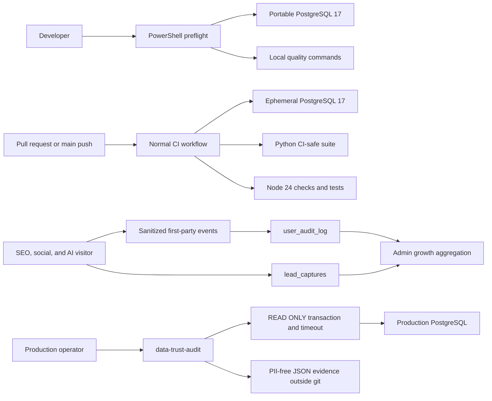

# P0-P1 Engineering, Growth Funnel, and Data Trust Design

**Date:** 2026-08-08

**Status:** Approved in writing by the user on 2026-08-08

**Scope:** developer/runtime truth, local PostgreSQL bootstrap, normal CI, the existing admin growth panel, first-party marketing tracking, and a repeatable production data-trust audit

## 1. Goal

Complete the audited P0 and P1 work without weakening Radar BDS production,
privacy, data-quality, or source-policy contracts.

The release must produce four independently verifiable outcomes:

1. a developer can identify and start the configured local runtime, create the
   correct test database, and run a deterministic preflight without exposing
   secrets;
2. normal pull requests and `main` pushes run a representative, production-safe
   Python and JavaScript quality gate against PostgreSQL;
3. the existing admin growth panel shows truthful marketing-source, landing,
   CTA, and directly attributable lead outcomes without inventing user journeys;
4. an operator can run one bounded production audit that is enforced read-only,
   emits no PII or credentials, and fails closed on critical data-trust
   violations.

P0 is complete only when the runtime/preflight and CI outcomes pass. P1 is
complete only when both the marketing-source view and the production read-only
audit are implemented and verified.

## 2. Current-State Evidence

Evidence below was collected from the `63fe14f` baseline on 2026-08-08. It is
not a permanent production claim.

### 2.1 Runtime and documentation

- `.env.local` points the application and tests to the portable PostgreSQL 17
  instance on `127.0.0.1:15432`. PostgreSQL 18 on port `5432` is a separate
  instance and must not be substituted.
- `AGENTS.md` and `docs/operations.md` describe the portable database correctly,
  while the opening sentence in `docs/dev_commands.md` and the runtime section
  in `docs/architecture.md` still describe PostgreSQL 18 as the normal local
  runtime.
- `AGENTS.md` still says Cloudflare is inactive. Current public headers, DNS,
  `docs/architecture.md`, and the definitive capacity record in
  `docs/operations.md` show that Cloudflare is active.
- `scripts/local_postgres.ps1 start` creates only `radar_bds`. It does not create
  `radar_bds_test`.
- Starting the already-initialized portable database successfully brought port
  `15432` online, but the script returned exit code `1` because `createdb`
  treated the existing `radar_bds` database as an error. The start command is
  therefore not idempotent.

### 2.2 Baseline quality gates

The repository has only the production capacity workflows. It has no normal
PR/main Python and JavaScript workflow.

With PostgreSQL 17 running and an explicit `RADAR_TEST_DATABASE_URL` targeting
`radar_bds_test`, the CI-safe baseline completed in 256 seconds:

- 2,700 tests passed;
- 2 tests skipped;
- 8 tests failed;
- the two live/local-state tests were deliberately excluded.

All eight failures reproduced when run alone:

| Area | Failure class |
|---|---|
| DB cleanup | a fixed `2026-05-10` fixture crossed the rolling 90-day boundary |
| Digital product checkout | form-count assertions do not distinguish checkout from the newer lead form |
| Digital product migration | the fake connection does not cover the newer Radar Ask usage migration helper |
| Radar Ask fast/deep performance | the route returns `503` under the isolated test configuration |
| Radar Ask retention, two tests | assertions count unrelated rows in shared tables instead of owned fixture rows |
| Map product disabled checkout | a global “no form” assertion conflicts with the valid lead form |

The new CI workflow cannot be considered complete while these known failures
remain red.

### 2.3 Marketing tracking

- `/api/track` already accepts `seo_landing_viewed`, `report_viewed`,
  `social_utm_visit`, `ai_referral_visit`, `cta_clicked`,
  `lead_capture_submit`, `vip_cta_click`, and `lead_vip_click`.
- SEO templates already attach page path/slug/title, UTM fields, detected AI
  source, and CTA destination in first-party audit events.
- SEO lead forms store the current page URL in `lead_captures.listing_url` and a
  bounded source context. This supports direct attribution for those form
  submissions, including UTM parameters present in the submitted URL.
- `services/admin_growth.py` currently reports crawl, signals, unique lots,
  price drops, signups, and leads. It does not aggregate marketing events.
- The current event model has no anonymous session or cross-page attribution
  key. A social/AI visit cannot be truthfully joined to a later arbitrary signal
  lead. The design must report such outcomes as unattributed rather than infer a
  journey from IP, user-agent, or timestamp proximity.
- Generic marketing actions currently pass their context through without a
  dedicated field allowlist. The reporting change needs a bounded, PII-free
  sanitizer before treating these fields as a stable analytics contract.

### 2.4 Data audit primitives

- `radar.py integrity-report` and `services/extraction_integrity_report.py`
  already provide a deterministic extraction-to-valuation comparison.
- `cli.system.compare_signal_read_model()` and
  `compare_listing_read_model()` already retain non-sensitive mismatch
  diagnostics.
- The `radar.py signal-read-model --compare` command calls `init_schema()`
  before comparing, so the command is not an acceptable production read-only
  audit entry point even when `--refresh` is absent.
- Map-location coverage, dataset versions, crawl timestamps, publisher
  visibility, and actionable-signal predicates already have reusable query or
  service primitives.

## 3. Constraints and Non-Goals

### 3.1 Hard constraints

- Preserve the PostgreSQL-only runtime and explicit test database guard.
- Never print connection passwords, API keys, phone numbers, emails, source
  URLs, IP addresses, user-agents, or raw listing descriptions from preflight,
  CI, the growth API, or the production audit.
- Guest/Free/VIP redaction and admin-only source URL/phone visibility remain
  unchanged.
- User-facing signals continue to use latest valuation plus
  `actionable_signal_sql()` and `actionable_listing_sql()`.
- Facebook remains the primary daily source; Guland remains secondary;
  BatDongSan remains legacy and disabled.
- No external LLM is added to crawl, reprocess, or the audit gate.
- A read-only production audit must not initialize schema, refresh or bump a
  dataset version, prewarm, reprocess, acquire a write-oriented job lock, or
  write its report into the repository.
- Existing unrelated work, including `.playwright-cli/`, stays untouched.

### 3.2 Non-goals

- Adding PostHog, a warehouse, a CRM, or another external analytics vendor.
- Creating fingerprint-based or IP-based visitor identity.
- Rebuilding the admin control room or replacing Chart.js.
- Treating event counts as unique people without a real uniqueness key.
- Solving P2 heatmap performance or the broader `app.py` modularization task.
- Running a new capacity campaign merely because CI or tracking changed.

## 4. Alternatives Considered

### 4.1 Minimal patches and a one-off production checklist

This would update docs, add a short workflow, derive a few counts from audit
logs, and run ad hoc SQL on production. It has the lowest implementation cost,
but the local bootstrap remains brittle, data-audit evidence is not
reproducible, and future agents can accidentally run mutating comparison paths.

### 4.2 Reproducible repository-owned foundation — chosen

Use one master design with three ordered workstreams:

1. runtime/preflight and green CI;
2. first-party marketing-source reporting;
3. an enforced read-only data-trust command and production evidence run.

Each workstream has its own tests and rollback boundary. This adds several
small repository artifacts but keeps all logic inspectable and vendor-neutral.

### 4.3 External product analytics and BI

An external analytics stack could eventually provide session journeys and
cohorting. It would require a vendor selection, consent/privacy review,
credentials, production script changes, and a separate source-of-truth
decision. Those tradeoffs are outside the P0-P1 scope.

## 5. Chosen Architecture



The workstreams share database and test conventions, but they do not share a
release transaction. A failure in marketing aggregation does not disable the
public site, and an audit failure does not mutate or roll back production data.

## 6. Workstream A: P0 Runtime Truth and Preflight

### 6.1 Documentation source of truth

`docs/operations.md` remains the detailed operational history and current
production runbook. `AGENTS.md` keeps only the short current facts. The change
will reconcile:

- portable PostgreSQL 17 on `15432` as this machine's active local override;
- PostgreSQL 18 on `5432` as a distinct optional instance;
- Cloudflare as the active public edge;
- the already-proven capacity boundary without repeating the stale pre-CDN
  warning;
- exact preflight and CI-safe test commands.

Historical evidence in `docs/operations.md` will not be rewritten as if it had
never occurred. Only current-state summaries and contradictory routing text are
corrected.

### 6.2 Idempotent local PostgreSQL bootstrap

Enhance `scripts/local_postgres.ps1` while preserving its public action names:

- `start` first checks `pg_isready` on the requested port;
- if the cluster is down, start it and wait within a bounded timeout;
- query `pg_database` before calling `createdb`;
- ensure both `radar_bds` and `radar_bds_test` exist;
- return zero when the desired end state is already true;
- `status` remains read-only and returns nonzero when unavailable;
- output contains no password or connection URI.

The script will not stop or reinitialize a running cluster and will never
delete a database.

### 6.3 Developer preflight

Add `scripts/dev_preflight.ps1` with:

- default diagnostic mode, plus `-StartLocalPostgres` and `-Json`;
- repository-root validation;
- Python 3.12 discovery using the documented interpreter;
- Node major-version validation, preferring the bundled workspace runtime when
  the system Node is incompatible;
- masked parsing of `DATABASE_URL` and `RADAR_TEST_DATABASE_URL`;
- enforcement that the test database name contains `test` and differs from the
  development database;
- TCP/readiness and `SELECT 1` checks for both configured databases;
- a concise list of the exact next commands, without automatically running the
  full suite.

Exit codes distinguish configuration, runtime, and dependency failures. JSON
contains only booleans, versions, host, port, and database names.

## 7. Workstream B: P0 Normal CI and Baseline Repairs

### 7.1 Workflow

Add one normal workflow for pull requests and pushes to `main`:

- Ubuntu 24.04;
- Python 3.12;
- Node 24;
- PostgreSQL 17 service with a dedicated `radar_bds_test` database;
- least workflow permissions: `contents: read`;
- concurrency that cancels superseded runs for the same branch;
- no production secrets and no external service calls.

The workflow runs:

1. dependency installation from the pinned runtime requirements plus a small
   pinned development requirements file;
2. `pip check` and a dependency audit with a documented baseline policy;
3. Python compile checks;
4. schema initialization against `radar_bds_test`;
5. the CI-safe Python suite, explicitly excluding only tests documented as
   live/local-state probes;
6. all repository JavaScript syntax and Node tests;
7. a tracked-file secret scan that reports paths/rules, never secret values.

Capacity workflows remain separate and never run from normal PRs.

### 7.2 Baseline repair policy

The eight reproduced failures are repaired before enabling the workflow as a
required gate:

- time-window tests use a frozen clock or fixture dates relative to the
  supplied clock;
- HTML tests assert the checkout form contract specifically and allow the
  independent lead form;
- migration fake connections cover the current helper contract without
  weakening production migration coverage;
- Radar Ask performance tests explicitly install a valid feature/tier test
  configuration and still assert zero inline provider work;
- retention tests count only rows created by their fixture or clean their
  owned tables safely.

Production behavior changes only if a failing test exposes a real bug. Stale
or overbroad tests are corrected to the intended current behavior.

## 8. Workstream C: P1 Marketing-Source View

### 8.1 Stable, sanitized tracking context

Add a dedicated marketing sanitizer for the relevant actions. Accepted fields
are bounded to known enums or short text:

- landing: `path`, `page_slug`, `page_title`;
- acquisition: `channel`, `utm_source`, `utm_medium`, `utm_campaign`,
  `utm_content`, `ai_source`, `referrer_host`;
- CTA: `cta_name`, `destination`, `source_surface`, `location`;
- lead event: `source_context` and `page_path` plus the UTM fields above.

Unknown keys are dropped. Values resembling absolute external URLs are reduced
to an allowed internal path or a bounded destination class where appropriate.
No raw referrer URL, free-form note, phone, email, IP, or user-agent is returned
by the growth API.

SEO tracking will attach the detected channel and acquisition fields directly
to the canonical page-view event for new traffic while keeping the existing
social/AI events for backward compatibility. Historical page-view rows without
channel remain `legacy_unknown`.

### 8.2 Aggregation contract

Extend `get_growth_dashboard()` with a `marketing` object for the selected
period:

- `coverage`: first/last event time and counts with/without a stable channel;
- `channels`: SEO/organic, social, AI, direct/unknown, and legacy unknown;
- `landing_pages`: path, views, social signals, AI signals, CTA clicks,
  directly attributed lead submissions, and lead status counts;
- `campaigns`: UTM source/medium/campaign with views, CTA clicks, and directly
  attributable lead submissions;
- `cta_targets`: normalized CTA name/destination and click count;
- `unattributed`: lead rows or lead events that cannot be joined safely.

All lists are bounded and deterministically sorted. The backend uses the
existing period bounds and indexed action/time window. JSON context parsing is
defensive: malformed or legacy context becomes empty context, never a 500.

### 8.3 Attribution truth boundary

The view reports event totals, not unique visitors. A lead is attributed to a
landing page or UTM campaign only when its stored `listing_url`,
`source_context`, or submitted lead event directly carries that value. The
implementation will not join guest rows by IP, user-agent, or time proximity.

Therefore the UI uses labels such as “directly attributed leads” and displays
the unattributed count. It does not publish a cross-session source-to-deposit
conversion rate from incomplete evidence.

### 8.4 Admin UI

Add one compact marketing-source section to `/admin/tang-truong`:

- channel summary cards;
- landing/campaign/CTA tables with empty and partial-coverage states;
- an attribution coverage note and unattributed count;
- no new public endpoint and no PII-bearing tooltip or export.

The existing crawl/product-growth charts remain unchanged.

## 9. Workstream D: P1 Read-Only Data-Trust Audit

### 9.1 Command contract

Add:

```text
radar.py data-trust-audit [--json] [--deep] [--limit 200]
```

The command does not call global schema initialization. It opens a fresh
PostgreSQL connection, starts a transaction, executes `SET TRANSACTION READ
ONLY`, applies a bounded local statement timeout, verifies
`transaction_read_only=on`, runs checks, and rolls back/ closes regardless of
outcome.

The database target is rendered only as scheme class, host, port, and database
name. User/password/query parameters are never emitted.

### 9.2 Checks

Default bounded checks:

- required tables, columns, and indexes exist;
- Facebook and Guland latest successful crawl timestamps and freshness;
- raw, canonical listing, active listing, latest valuation, actionable signal,
  and signal-card read-model counts;
- actionable rows satisfy nonzero price/area and current suppression rules;
- durable `signals`, `listings`, and `market` versions are present and positive
  when the corresponding production feature flags require them;
- signal read-model actionable count and public filtered count agree for the
  default production filter contract;
- map locations report honest precision buckets and mapped/unmapped totals;
- Guland publisher visibility classifications are within the allowed policy
  set;
- extraction audit reports a bounded flagged count by field without title,
  description, URL, phone, or row samples.

`--deep` additionally runs existing signal and listing read-model comparisons
directly, without `init_schema()` or refresh. Diagnostics retain only case,
tier, counts, IDs, field names, and metadata field names.

### 9.3 Result model and exit codes

Every check returns:

- `name`;
- `status`: `pass`, `warn`, `fail`, or `skipped`;
- safe numeric measurements;
- a stable reason code;
- threshold/source timestamp when relevant.

Top-level output includes `overall_status`, masked target, generated time,
duration, and checks. Exit `0` means no failures, exit `1` means one or more
data-trust failures, and exit `2` means configuration or audit execution could
not be verified. Warnings never silently become passes.

Thresholds are explicit and source-aware. BatDongSan freshness is not required.
Missing optional data is `skipped` or `warn`, while broken invariants,
read-write transaction state, and required read-model parity are failures.

### 9.4 Production execution

After an authorized release of the exact pushed SHA:

1. verify the deployed SHA and active service separately;
2. run the default audit on the VPS and retain JSON outside the repository;
3. run `--deep` in a bounded maintenance window if default checks pass;
4. run existing public cache/redaction smoke checks independently;
5. report DB audit, service, HTTP, cache, and browser evidence as distinct
   boundaries.

An audit failure is evidence for follow-up. It does not authorize automatic
reprocess, refresh, deletion, relabeling, or feature-flag changes.

## 10. Error Handling and Safety

- Preflight failures name the missing component and remediation command without
  printing secrets.
- CI uses only the test database and fails before tests if its name does not
  contain `test`.
- Marketing JSON parsing treats malformed context as unattributed.
- Marketing queries are bounded by time window and result count, use existing
  indexed action/time access, and remain admin-only/cached.
- The data audit verifies read-only state before any domain query and uses a
  statement timeout. Any timeout is `unverified`/failure, never success.
- Reports are written only to an explicit path or stdout; production runtime
  evidence stays ignored/uncommitted.
- A credential observed in local tool output during this audit must be rotated
  before an authorized production release. Rotation is an external operational
  action and is not performed merely by merging code.

## 11. Testing Strategy

Implementation follows TDD. Required test groups:

### 11.1 Preflight and bootstrap

- PowerShell parser validation;
- first start, repeated start, existing dev DB, missing test DB, unavailable
  port, and status exit-code contracts;
- URL masking and dev/test database separation;
- JSON output contains no password/token-shaped values.

### 11.2 CI and baseline

- workflow static contract for triggers, versions, permissions, Postgres test
  target, exclusions, JS tests, and absence of production secrets/actions;
- all eight existing baseline failures pass independently;
- full CI-safe Python suite and all JavaScript tests pass locally.

### 11.3 Marketing funnel

- sanitizer allowlist, truncation, malformed input, internal destinations, and
  PII key rejection;
- channel/landing/campaign/CTA aggregation for current and previous periods;
- direct lead attribution and explicit unattributed behavior;
- admin authentication, cache, bounded SQL windows, malformed legacy JSON;
- admin template/JavaScript/CSS contract and empty state.

### 11.4 Data-trust audit

- parser and CLI exit codes;
- `SET TRANSACTION READ ONLY`, transaction-state verification, timeout, and
  rollback/close behavior;
- no schema initialization, refresh, version bump, prewarm, or write query;
- safe masked output and no sensitive fields;
- pass, warning, mismatch, timeout, missing-schema, and deep-compare cases;
- PostgreSQL integration test proving `SHOW transaction_read_only` is `on`.

## 12. Delivery and Rollback

Implementation should use small commits on `codex/p0-p1-foundation` in this
order:

1. P0 runtime truth, bootstrap, preflight, baseline repairs, and CI;
2. P1 marketing sanitizer, backend aggregation, and admin UI;
3. P1 read-only audit command, tests, and operations documentation.

Each commit must pass its focused tests. The final branch gate is the full
CI-safe Python suite, all JavaScript tests, PowerShell parser checks, and
`git diff --check`.

Code completion does not imply production completion. Push/deploy, credential
rotation, and the production audit require explicit production authorization.
If authorized, the release must prove the pushed/deployed SHA, service state,
read-only audit result, HTTP/cache/redaction smoke, and public behavior as
separate evidence.

Rollback boundaries:

- docs/preflight/CI can be reverted without runtime data change;
- marketing UI/API additions can be reverted without deleting audit events or
  lead rows;
- the audit command is read-only and can be removed without data rollback;
- no workstream requires a production reprocess.

## 13. Acceptance Criteria

### P0

- Runtime docs agree on the active local database and Cloudflare state.
- Repeated `local_postgres.ps1 start` returns zero and both local databases
  exist.
- Preflight succeeds on the documented machine and masks all secrets.
- Normal CI exists for PR/main, uses PostgreSQL 17/Python 3.12/Node 24, and has
  no production side effects.
- The eight reproduced failures and the complete CI-safe suite are green.

### P1 marketing

- Admin growth exposes bounded marketing channel, landing, campaign, CTA, and
  directly attributed lead results.
- Malformed/legacy events do not break the endpoint.
- UI explains event-vs-user and attribution coverage limits.
- No response or rendered table exposes PII or secret-bearing fields.

### P1 data trust

- The command proves transaction read-only state and never initializes or
  mutates schema/data/read models/versions.
- Default and deep outputs are safe, bounded, machine-readable, and fail closed.
- Local integration tests pass.
- After explicit release authorization, the exact deployed revision completes
  the production default audit; deep parity is either a verified pass or is
  reported as a concrete unresolved production failure rather than omitted.
